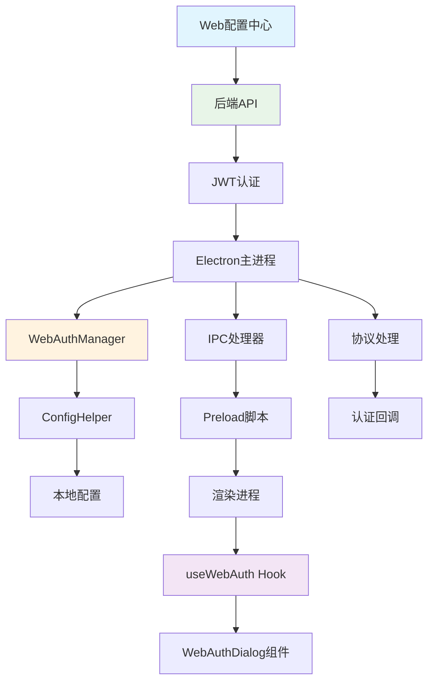

# Phase 3 - 客户端集成开发完成报告

## 概述
Phase 3 成功完成了Electron客户端与Web配置中心的集成，实现了统一的配置管理和用户认证体系。

## 完成的功能模块

### 1. Web认证管理器 (WebAuthManager.ts)
- **功能**: 统一的Web认证管理
- **位置**: `InterviewCodeOverlay/electron/WebAuthManager.ts`
- **主要特性**:
  - JWT token自动管理和刷新
  - 用户配置同步
  - 本地配置映射
  - 连接状态检查
  - 事件驱动的状态管理

### 2. 配置系统扩展
- **扩展了ConfigHelper**: 支持Web认证tokens存储
- **新增字段**:
  - `webAuthTokens`: JWT访问和刷新token
  - `webConfig`: Web配置缓存

### 3. 主进程集成 (main.ts)
- **Web认证初始化**: 应用启动时自动检查认证状态
- **协议处理**: 支持`interview-coder://`协议用于认证回调
- **事件监听**: 处理认证状态变化和配置同步
- **自动配置同步**: 登录后自动同步用户配置

### 4. IPC处理器扩展
- **新增IPC方法**:
  - `web-auth-login`: 打开Web登录
  - `web-auth-logout`: 用户登出
  - `web-auth-status`: 检查认证状态
  - `web-sync-config`: 同步配置
  - `web-update-config`: 更新Web配置
  - `web-get-ai-models`: 获取可用AI模型
  - `web-get-languages`: 获取编程语言列表
  - `web-check-connection`: 检查连接状态

### 5. 渲染进程集成

#### Web认证Hook (useWebAuth.ts)
- **位置**: `InterviewCodeOverlay/src/hooks/useWebAuth.ts`
- **功能**: React状态管理和操作方法
- **提供的状态**:
  - 认证状态和用户信息
  - Web配置数据
  - 连接状态
- **提供的方法**:
  - `login()`: 打开Web登录
  - `logout()`: 用户登出
  - `syncConfig()`: 同步配置
  - `checkConnection()`: 检查连接

#### Web认证界面组件 (WebAuthDialog.tsx)
- **位置**: `InterviewCodeOverlay/src/components/WebAuth/WebAuthDialog.tsx`
- **功能**: 用户友好的认证管理界面
- **特性**:
  - 连接状态实时显示
  - 认证状态管理
  - 错误处理和用户指导
  - 响应式设计

### 6. 类型定义更新
- **扩展了ElectronAPI接口**: 添加所有Web认证相关方法
- **类型安全**: 完整的TypeScript类型支持

### 7. Preload脚本更新
- **暴露Web认证API**: 渲染进程可安全访问主进程功能
- **事件监听器**: 支持认证状态和配置变化事件

## 技术架构

## 工作流程

### 1. 认证流程
1. 用户点击"Web登录"按钮
2. 检查Web服务器连接状态
3. 打开系统浏览器到登录页面
4. 用户在Web界面完成登录
5. Web服务器发送认证回调到客户端
6. 客户端处理回调，保存JWT tokens
7. 自动同步用户配置

### 2. 配置同步流程
1. 客户端发送API请求获取用户配置
2. 将Web配置映射到本地配置格式
3. 更新ConfigHelper中的配置数据
4. 通知渲染进程配置已更新
5. 界面实时反映配置变化

### 3. 自动token刷新
1. API请求返回401错误
2. 自动使用refresh token请求新的access token
3. 重试原始请求
4. 如果刷新失败，清除认证状态并提示重新登录

## 安全特性

### 1. Token管理
- JWT tokens安全存储在本地配置文件
- 自动token刷新机制
- token失效时安全清理

### 2. 协议安全
- 自定义协议处理认证回调
- 防止恶意协议调用
- 参数验证和清理

### 3. 连接安全
- HTTPS连接到Web服务器
- 请求超时保护
- 错误处理和用户反馈

## 用户体验

### 1. 无缝集成
- 用户首次使用时自动提示Web登录
- 登录后配置自动同步
- 界面实时反映认证和配置状态

### 2. 错误处理
- 清晰的错误消息和解决方案
- 连接失败时的指导说明
- 重试机制和状态恢复

### 3. 状态反馈
- 实时连接状态显示
- 认证状态可视化
- 加载状态和进度指示

## 后续扩展点

### 1. 离线模式
- 本地配置缓存
- 离线状态检测
- 配置冲突解决

### 2. 多用户支持
- 用户切换功能
- 配置隔离
- 快速用户切换

### 3. 高级配置
- 配置导入/导出
- 配置版本管理
- 配置模板系统

## 测试建议

### 1. 单元测试
- WebAuthManager的各个方法
- 配置同步逻辑
- token刷新机制

### 2. 集成测试
- 完整的认证流程
- 配置同步端到端测试
- 错误场景处理

### 3. 用户测试
- 首次使用体验
- 网络异常处理
- 界面响应性测试

## 总结

Phase 3成功实现了客户端与Web配置中心的深度集成，为用户提供了统一、安全、用户友好的配置管理体验。系统架构清晰，扩展性良好，为后续功能开发奠定了坚实基础。

主要技术亮点：
- 🔐 安全的JWT认证体系
- 🔄 自动配置同步机制  
- 🎯 用户友好的界面设计
- 🛡️ 完善的错误处理
- 📱 响应式状态管理
- 🔧 类型安全的API设计 