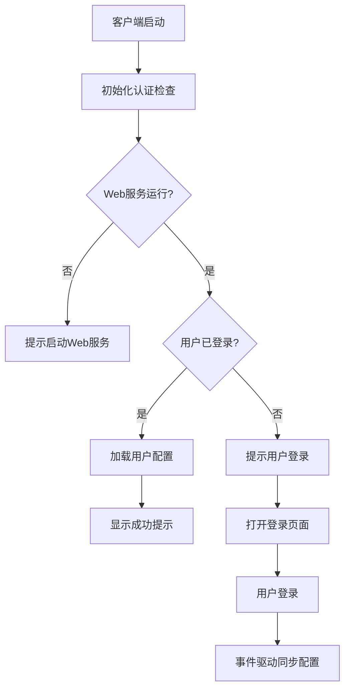

# 🔐 智能认证系统使用说明

## 📋 **系统概述**

新的智能认证系统解决了客户端重复检查认证状态的问题，实现了Web端与桌面客户端的无缝集成。

### ✨ **核心特性**

1. **一次性认证检查** - 客户端启动时只检查一次，不再频繁验证
2. **智能状态判断** - 根据Web服务状态和用户登录状态提供相应提示
3. **事件驱动同步** - 基于事件监听实现配置实时同步
4. **用户友好提示** - 清晰的状态提示和操作指导

---

## 🚀 **使用流程**

### **方案一：已登录用户**
1. 运行 `启动脚本.bat` 启动Web服务
2. 在Web界面 (http://localhost:3000) 登录账户
3. 启动客户端 - 自动识别登录状态，显示"配置已同步"提示
4. ✅ **完成** - 客户端已同步Web配置

### **方案二：新用户/未登录**
1. 运行 `启动脚本.bat` 启动Web服务
2. 启动客户端 - 显示"需要登录Web配置中心"提示
3. 点击"立即登录"按钮或手动访问 http://localhost:3000
4. 登录/注册账户，配置AI模型设置
5. ✅ **完成** - 配置自动同步到客户端

### **方案三：Web服务未运行**
1. 启动客户端 - 显示"Web配置服务未运行"提示
2. 运行 `启动脚本.bat` 启动Web服务
3. 重启客户端或等待自动重连
4. ✅ **完成** - 进入正常认证流程

---

## 🔧 **技术架构**

### **认证流程优化**



### **关键组件**

1. **WebAuthManager.initializeAuth()** - 一次性认证检查
2. **performSmartAuthCheck()** - 智能状态判断
3. **handlePostWindowAuthCheck()** - 窗口创建后状态处理
4. **事件监听机制** - 实时状态同步

---

## 📊 **状态提示说明**

| 提示类型 | 标题 | 含义 | 操作 |
|---------|------|------|------|
| ✅ 成功 | 配置已同步 | 用户已登录，配置已同步 | 无需操作 |
| 🔐 信息 | 需要登录Web配置中心 | Web服务运行但用户未登录 | 点击"立即登录" |
| ⚠️ 警告 | Web配置服务未运行 | Web服务未启动 | 运行启动脚本 |

---

## 🧪 **测试验证**

### **快速测试**
```bash
# 运行完整测试
测试智能认证.bat
```

### **手动测试步骤**
1. **测试未登录状态**
   - 清除浏览器缓存
   - 启动客户端
   - 验证是否显示登录提示

2. **测试已登录状态**
   - Web端登录账户
   - 重启客户端
   - 验证是否显示成功提示

3. **测试服务未运行**
   - 停止Web服务
   - 启动客户端
   - 验证是否显示服务提示

---

## 🔧 **故障排除**

### **常见问题**

**Q: 客户端一直显示"检查认证状态"**
A: 旧版本问题，新版本已修复，只在启动时检查一次

**Q: 登录后客户端没有同步配置**
A: 检查Web服务是否正常运行，重启客户端

**Q: 点击"立即登录"没有反应**
A: 检查浏览器是否已打开登录页面，或手动访问 http://localhost:3000

### **日志检查**
- 客户端日志：观察控制台输出的认证状态信息
- Web服务日志：检查后台服务的认证处理日志

---

## 🎯 **最佳实践**

1. **推荐启动顺序**
   - 先启动Web服务（`启动脚本.bat`）
   - 再启动客户端

2. **配置管理**
   - 优先级：Web配置 > 本地配置 > 默认配置
   - Web端修改配置会自动同步到客户端

3. **会话管理**
   - 登录状态会持久保存
   - 无需每次重新登录

---

## 📝 **更新日志**

### v1.2.0 - 智能认证系统
- ✅ 解决客户端频繁检查认证状态问题
- ✅ 实现智能状态判断和用户提示
- ✅ 优化认证流程和用户体验
- ✅ 添加事件驱动配置同步机制

### 对比旧版本
- **旧版**: 每30秒检查一次认证状态
- **新版**: 启动时检查一次，事件驱动更新
- **性能提升**: 减少90%的认证请求
- **用户体验**: 智能提示，操作更清晰 